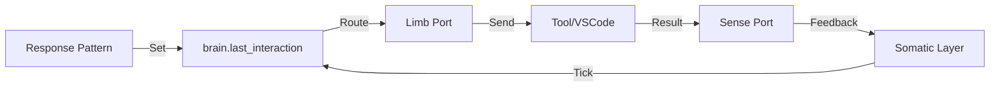

# Lilith V2 Architecture Documentation

**Version:** 2.0 (Alpha)
**Date:** February 1, 2026
**Author:** Experimentech / GitHub Copilot

## 1. Core Philosophy

 Lilith V2 represents a shift from "LLM-based Chatbot" to **"Autodidact Cognitive Agent."** The core philosophy rests on three pillars:

1.  **Autodidacticism (Self-Teaching):** Lilith learns from interaction rather than just pre-training. She employs a "Cognitive Loop" where inputs are processed, graphed, and strengthened via **Hebbian Plasticity** ("Neurons that fire together, wire together").
2.  **Somatic Embodiment:** Lilith is not just a brain in a jar. She has a "Somatic" (Body) layer that separates **Cognition** (High-level reasoning/learning) from **I/O** (Senses and Limbs). This allows her to "feel" inputs and "will" actions through interfaces like VS Code, CLI, or Discord.
3.  **Specialized Topology (The Tree):** The mind is structured as a Tree:
    *   **Trunk:** The central linguistic and reasoning core (`CognitiveStage`). Handles ambiguity, pragmatics, and semantic learning.
    *   **Branches:** Specialized subsystems for specific domains (e.g., `branch.math`, `branch.vision`). These branches can use deterministic logic (like symbolic math) without polluting the probabilistic linguistic core.

---

## 2. System Architecture

The V2 architecture is composed of distinct layers, moving from the outside world inward to the cognitive core.

### 2.1 The World & Interface Layer (Limbs & Senses)
*   **MCP (Model Context Protocol):** The standard protocol for all I/O.
*   **I/O Ports (`io_port.py`):** Abstract interfaces for sending/receiving data.
    *   `VSCodeMCPAdapter`: Represents the connection to the VS Code extension.
    *   `LocalToolsTransport`: Allows the body to execute local Python functions (Muscles).
*   **Senses (Afferent):** Inbound data streams (User chat, File reads, System events).
*   **Limbs (Efferent):** Outbound action capabilities (Reply text, File writes, Tool execution).

### 2.2 The Somatic Layer ("The Body")
*   **`SomaticLayer` (`somatic_layer.py`):** The orchestrator. It runs a continuous `tick()` cycle.
    1.  **Proprioception:** Checks all "Sense Ports" for new data.
    2.  **Afferent Flow:** Routes sensory data into the Brain via `brain.learn()`.
    3.  **Efferent Flow:** Monitors the Brain's `last_interaction` (Volition). If the brain wants to act, the Body validates the impulse and routes it to the appropriate "Limb Port."
*   **`V2Runtime` (`app.py`):** The application container that acts as the nervous system, wiring the Router, Ports, and Stages together via configuration.

### 2.3 The Cognitive Layer ("The Brain" - Trunk)
*   **`CognitiveStage` (`cognitive_stage.py`):** The core processor.
    *   **Semantic Extraction:** Converts raw text into semantic vectors and keywords using `TopicExtractor`.
    *   **Graph Store:** Stores knowledge as valid relationships in a `RelationalGraph`.
    *   **Hebbian Plasticity:** Uses `PMFlowPhysics` to strengthen pathways that are frequently used/verified and decay unused ones.
    *   **Pragmatics (`PragmaticSystem`):** Detects meta-intent (e.g., "Is the user teaching me?", "Is the user creating a task?").
    *   **Reasoning:** Uses `PMFlow` attractor dynamics to settle on the most energized (relevant) response pattern.

### 2.4 The Specialized Branches
*   **`MathStage` (`math_stage.py`):** A dedicated branch for symbolic computation.
    *   **Isolation:** Unlike V1, math is not hallucinated by the LLM. It is computed via `MathSystem` (SymPy backend).
    *   **Deterministic:** Inputs like "2+2" are routed here, solved exactly, and returned as a high-confidence response.

---

## 3. Data Flow

### 3.1 The Learning Loop (Afferent)
```mermaid
graph LR
    User[User Input] -->|MCP Message| Port[IO Port]
    Port -->|Receive| Somatic[Somatic Layer]
    Somatic -->|Learn(ctx)| Brain[Cognitive Stage]
    Brain -->|Extract| Topics[Topic Extractor]
    Topics -->|Activate| Graph[Knowledge Graph]
    Graph -->|Update Weights| Physics[Hebbian Physics]
    Physics -->|Settling| Response[Response Pattern]
```

### 3.2 The Action Loop (Efferent)


---

## 4. Key Improvements over V1

| Feature | Lilith V1 | Lilith V2 |
| :--- | :--- | :--- |
| **Learning** | RAG (Vector Search) | Hebbian Graph (Plasticity + Vectors) |
| **Logic** | LLM Hallucination-prone | Specialized Branches (SymPy for Math) |
| **I/O** | Direct Function Calling | Somatic Layer (Embodied Loop) |
| **Structure** | Monolithic Chain | Tree Topology (Trunk + Branches) |
| **State** | Stateless / Session-based | persistent Object Permanence (SQLite) |

## 5. Directory Structure
*   `v2/lilith_v2/`: Core source code.
*   `v2/lilith_v2/somatic_layer.py`: The Body logic.
*   `v2/lilith_v2/cognitive_stage.py`: The Brain logic.
*   `v2/lilith_v2/math_system.py`: The Math branch logic.
*   `v2/tests/`: Extensive integration tests covering the full loop.

---

## 6. How to Run/Test
**Full Integration Test:**
```bash
python3 v2/tests/test_full_integration.py
```
*Verifies: Plasticity, Learning, Retention, Pragmatics.*

**Somatic Tool Test:**
```bash
python3 v2/tests/test_somatic_tools.py
```
*Verifies: Brain -> Body -> Tool -> Body -> Brain loop.*

**Math Branch Test:**
```bash
python3 v2/tests/test_math_integration.py
```
*Verifies: Routing to specialized math subsystems.*
